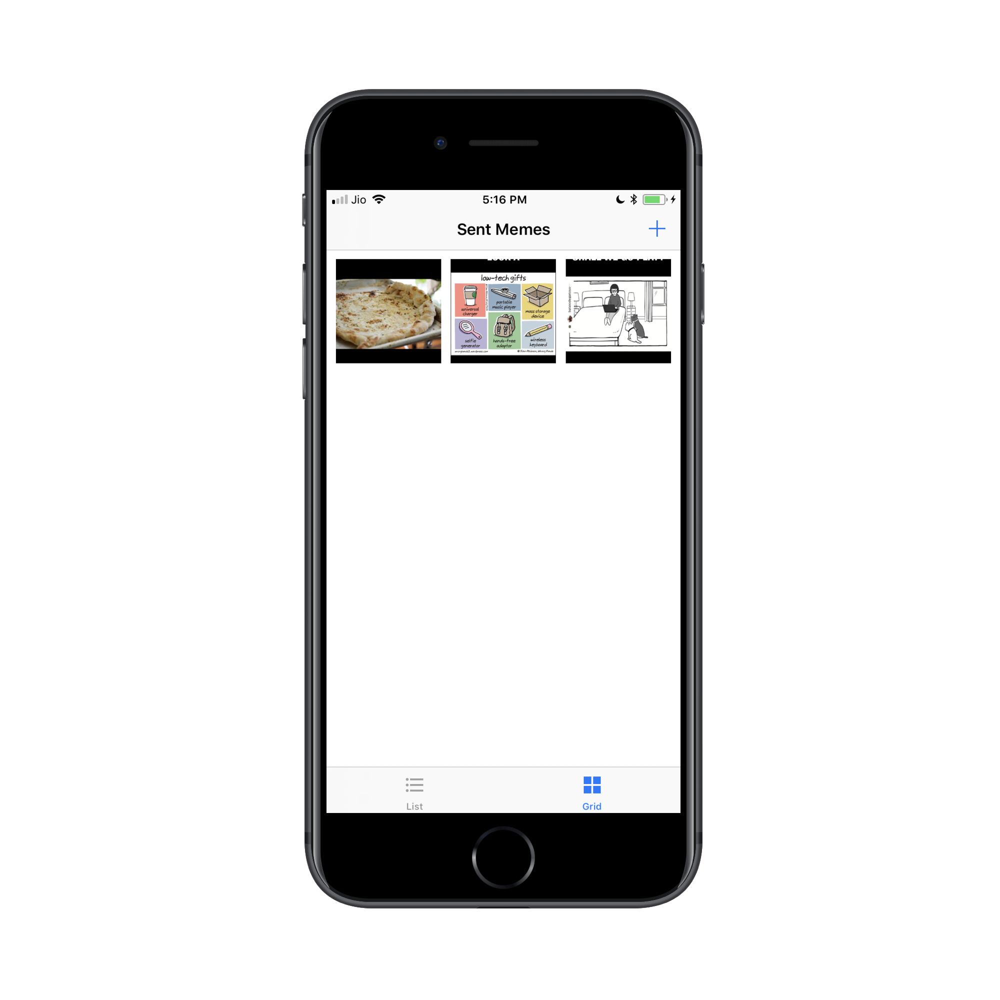
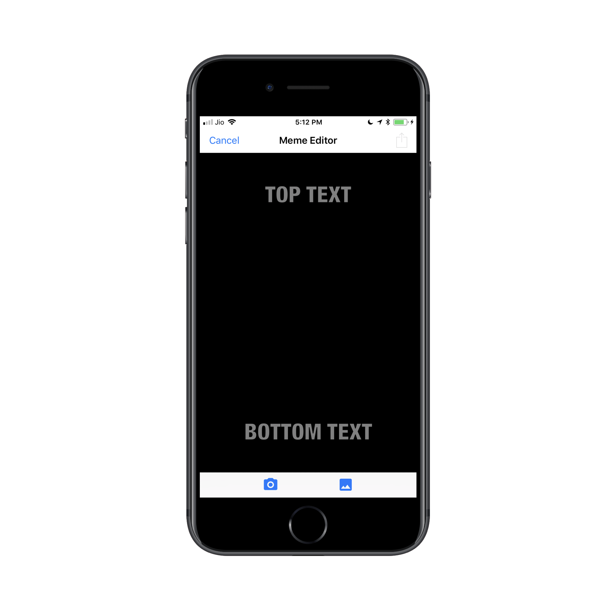

# Meme Me
Meme Me is an app that creates memes from images! The Meme Editor enables the user to take a picture, and add text at the top and bottom to form a meme, and share the meme with friends. The Collection screen shows sent memes in both a table and collection view.

## Screenshots

#### Meme Collection
| Empty Screen | Collection | Table |
| ------------ | ---------- | ----- |
|  |  |  |

#### Meme Editor
| Empty | Editing |
| ----- | ------- |
|  |  |

## Frameworks Used
1. [Foundation](https://developer.apple.com/documentation/foundation)
2. [UIKit](https://developer.apple.com/documentation/uikit)

## How to Build
1. Download zip or fork & clone project on your desktop.
2. Open `MemeMe.xcodeproj` file in Xcode.

## Licence
This project is a part of Master Projects repository. For other projects and licensing information, please see [iOS Nanodegree Projects](https://github.com/rajanikantdeshmukh/iOS-Nanodegree-Projects).
