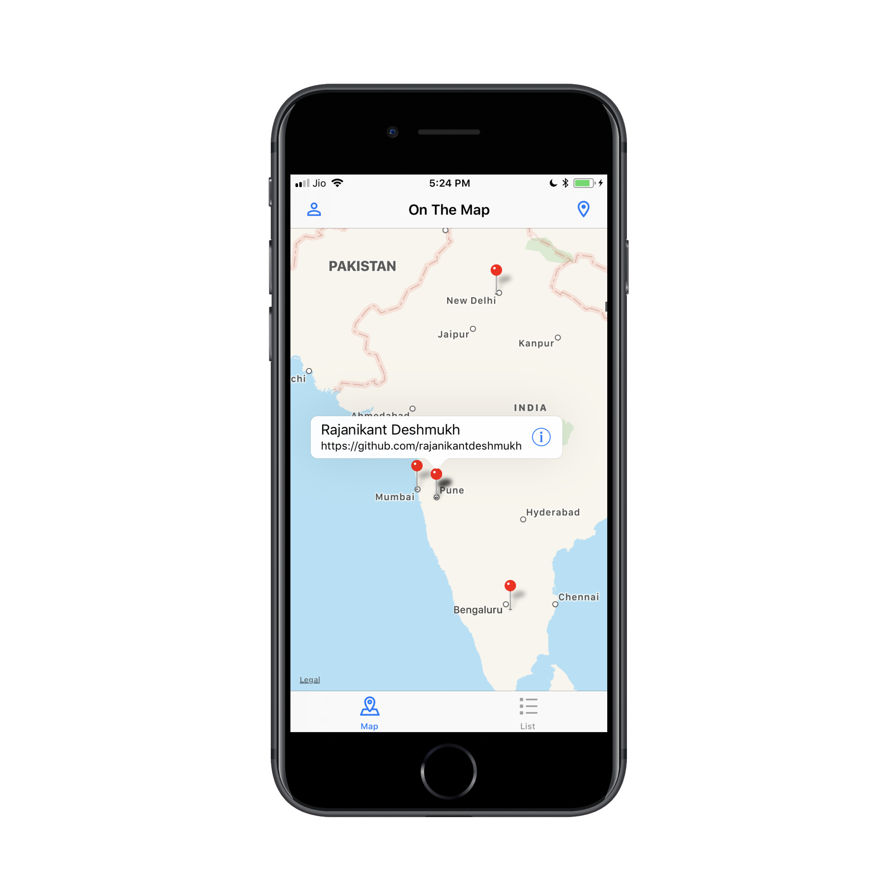
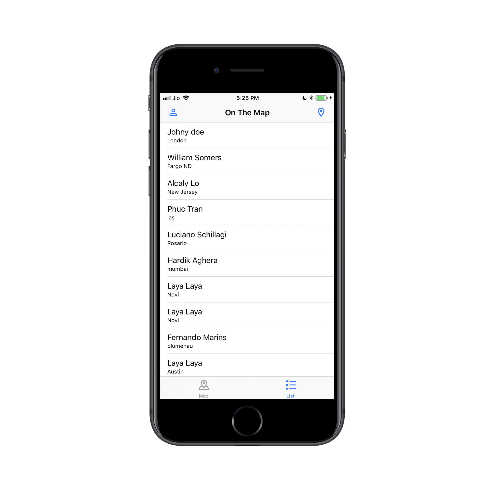

# On The Map
On The Map displays information posted by other Udacity students, by interacting with Udacity's Authentication and Parse APIs. The app has a map view with pins representing student locations, and by tapping a pin, the app will display a custom URL posted by a student.

# Screenshots

| Login Screen | Student Pin | List |
| ------------ | ----------- | ---- |
|  |  | 

| Account | Add Pin | Add Profile |
| ------- | ------- | ----------- |
|  |  |  |

## Frameworks Used
1. [Foundation](https://developer.apple.com/documentation/foundation)
2. [UIKit](https://developer.apple.com/documentation/uikit)
3. [MapKit](https://developer.apple.com/documentation/mapkit)

## How to Build
1. Download zip or fork & clone project on your desktop.
2. Open `On The Map.xcodeproj` file in Xcode.
3. Now you can build and run the app.

## Licence
This project is a part of Master Projects repository. For other projects and licensing information, please see [iOS Nanodegree Projects](https://github.com/rajanikantdeshmukh/iOS-Nanodegree-Projects).
