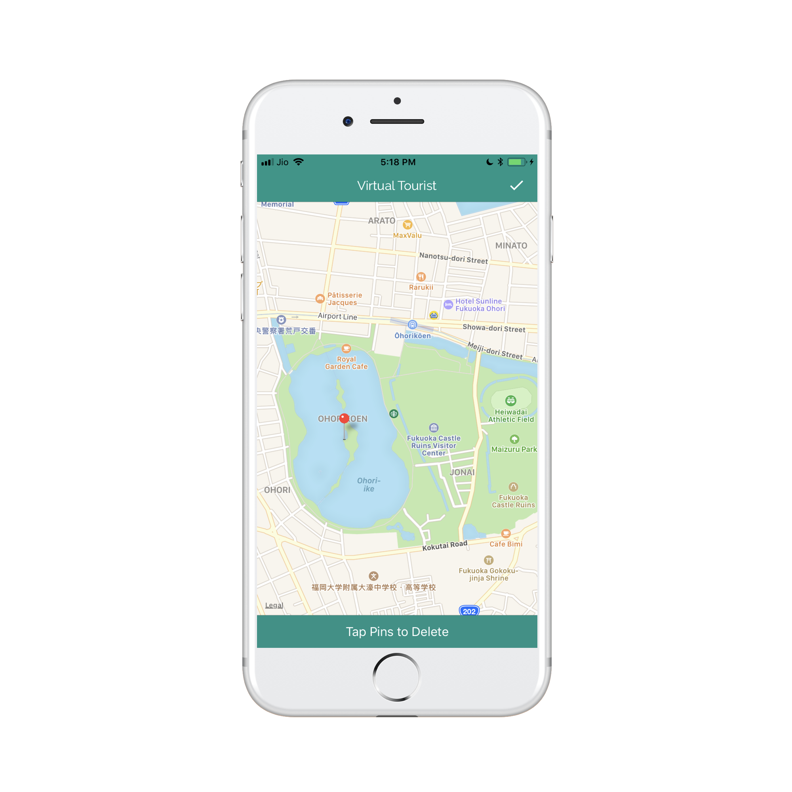
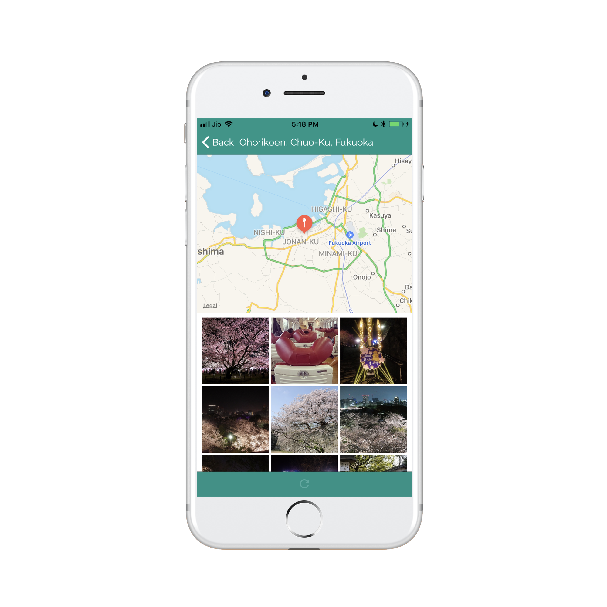
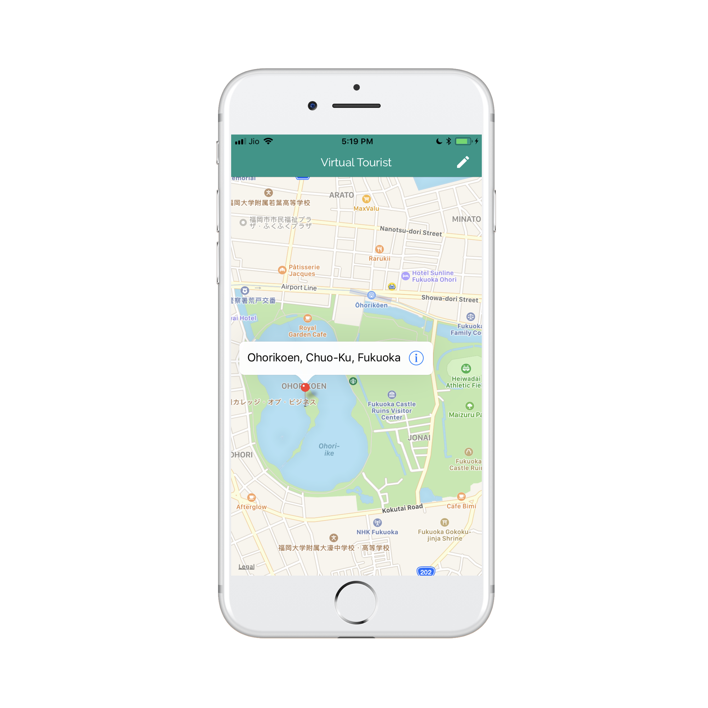

# Virtual Tourist
Tour the world without leaving the comforts of your couch! Virtual Tourist lets you tour the world from the comfort of your own couch. Users is able to drop pins on a map and download pictures for the location.

## Screenshots

| Map | Album | Map: Delete Mode |
| --- | ----- | ---------------- |
|  |  | 

## Libraries and Frameworks Used
**iOS Frameworks**:
1. [Foundation](https://developer.apple.com/documentation/foundation)
2. [UIKit](https://developer.apple.com/documentation/uikit)
3. [MapKit](https://developer.apple.com/documentation/mapkit)
4. [Core Data](https://developer.apple.com/documentation/coredata) to store data and images.

**External Library**
6. [Kingfisher](https://github.com/onevcat/Kingfisher/) for easy image loading.

## How to Build
The build system uses [CocoaPods](https://cocoapods.org) to integrate dependencies. You should be familiar with CocoaPods and API key and secret from Flickr account.
1. Download zip or fork & clone project on your desktop.
2. Open Terminal and `cd` into project folder.
3. Run `pods install` to install dependencies.
4. Open `Virtual Tourist/Virtual Tourist.xcworkspace` with Xcode.
5. Now you can build and run the app.

## Licence
This project is a part of Master Projects repository. For other projects and licensing information, please see [iOS Nanodegree Projects](https://github.com/rajanikantdeshmukh/iOS-Nanodegree-Projects).
